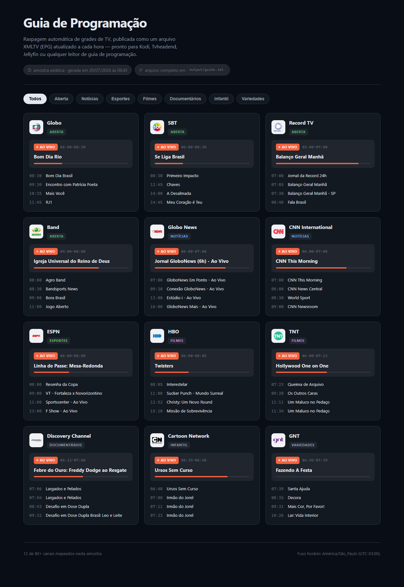
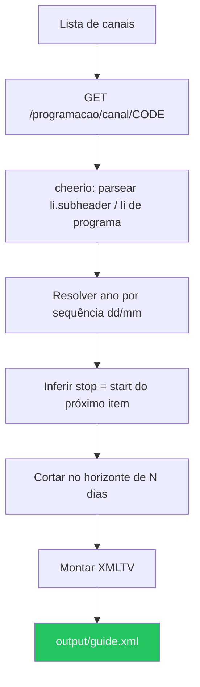

# epg-tv-scraper


-orange)


Raspagem horária de grades de programação de TV, publicada como um arquivo **XMLTV (EPG)** — o formato padrão que Kodi, Tvheadend, Jellyfin, Plex e qualquer PVR/IPTV sabem ler.

## A coisa em ação



Demo estática completa em [`demo/index.html`](demo/index.html) (abra localmente ou publique como página estática) — usa uma amostra real capturada da raspagem, não dado inventado.

## Links

```
Repositório: https://github.com/ronaldoribeirosm/epg-tv-scraper
Arquivo EPG: https://raw.githubusercontent.com/ronaldoribeirosm/epg-tv-scraper/main/output/guide.xml
```

## O problema

Um cron que só chama uma API pronta de "TV guide" não prova nada — o trabalho de verdade é lidar com uma fonte que **não foi feita pra ser consumida por máquina**: HTML server-rendered sem endpoint JSON, datas escritas como `"terça-feira, 21/7"` sem ano, sem horário de término em lugar nenhum, e comentários de template do próprio site vazando no HTML de produção.

## A solução (visão geral)

- **Fonte escolhida por ter HTML server-rendered em uma rota liberada por `robots.txt`** — o candidato óbvio (`mi.tv`) bloqueia justamente a rota assíncrona que carrega a grade (`Disallow: /*async*`), então foi descartado. `meuguia.tv` não tem `robots.txt` e serve a grade completa (~7 dias) direto no HTML da página de cada canal.
- **Ano inferido por sequência, não fixado** — o site nunca imprime o ano, só `dd/mm`. Como a grade vem em ordem cronológica, um mês que "volta" em relação ao anterior significa que a virada foi de dezembro pra janeiro (`resolveYear` em [`src/util/dates.ts`](src/util/dates.ts)).
- **Horário de término inferido, nunca inventado** — o site também não informa fim de programa. O fim de cada item é o início do próximo na mesma lista cronológica (inclusive atravessando a virada do dia); o último programa da janela buscada fica sem `stop` em vez de receber uma duração arbitrária.
- **Falha por canal não derruba a raspagem inteira** — se um canal falhar (timeout, HTML mudou), os outros 80+ continuam e o arquivo final é gravado com quem respondeu; a raspagem inteira só aborta se **nenhum** canal retornar dado.



## Stack

| Camada | Tecnologia |
|---|---|
| Linguagem | TypeScript (Node 20, ESM) |
| Parsing de HTML | cheerio |
| Geração de XML | xmlbuilder2 |
| Testes | vitest, com fixture real (HTML salvo de uma página de canal de verdade) |
| Agendamento | GitHub Actions (`schedule: cron`), sem servidor próprio |
| Demo | HTML/CSS/JS estático, sem build step |

## Como rodar localmente

```bash
npm install
npm run scrape       # gera output/guide.xml
npm test             # roda a suíte com a fixture real
npm run typecheck
```

Variáveis de ambiente opcionais:

| Variável | Padrão | Efeito |
|---|---|---|
| `EPG_DELAY_MS` | `400` | Pausa entre requisições a canais diferentes (educação com o servidor de origem) |
| `EPG_DAYS_AHEAD` | `7` | Até quantos dias no futuro manter no XML final |

## Como o cron funciona

O workflow [`.github/workflows/scrape.yml`](.github/workflows/scrape.yml) roda `0 * * * *` (todo início de hora) via GitHub Actions — sem servidor, sem VPS, sem serviço pago. A cada execução:

1. Faz `npm run scrape` do zero (não é incremental — a fonte já entrega ~7 dias por request).
2. Se `output/guide.xml` mudou, commita e dá push direto no `main` como `github-actions[bot]`.
3. Se nada mudou (raro, mas possível dentro da mesma hora), não cria commit vazio.

Isso significa que o link abaixo é sempre a versão mais recente, sem precisar hospedar nada:

```
https://raw.githubusercontent.com/ronaldoribeirosm/epg-tv-scraper/main/output/guide.xml
```

## Formato de saída (XMLTV)

```xml
<?xml version="1.0" encoding="UTF-8"?>
<tv generator-info-name="epg-tv-scraper" generator-info-url="https://github.com/ronaldoribeirosm/epg-tv-scraper">
  <channel id="grd.meuguia.tv">
    <display-name lang="pt">Globo</display-name>
    <icon src="https://assets.meuguia.tv/logos/grd.png"/>
  </channel>
  ...
  <programme start="20260720060000 -0300" stop="20260720083000 -0300" channel="grd.meuguia.tv">
    <title lang="pt">Bom Dia Rio</title>
    <category lang="pt">Jornalismo/Informativo</category>
  </programme>
  ...
</tv>
```

- `channel.id` é `{código}.meuguia.tv` — namespace estável pra evitar colisão com outras fontes XMLTV.
- Horário sempre com offset fixo `-0300` (Brasil não tem mais horário de verão desde 2019, então não há ambiguidade de fuso).
- `<programme>` sem `stop` significa "último item conhecido da janela buscada" — melhor omitir do que inventar uma duração.

## Canais incluídos

83 canais em [`src/channels.ts`](src/channels.ts), cobrindo TV aberta, notícias, esportes, filmes, séries, documentários, infantil e variedades. Pra adicionar um canal:

1. Abra `https://www.meuguia.tv/programacao/categoria/<categoria>` (ex.: `Filmes`, `Series`, `Esportes`, `Noticias`, `Infantil`, `Variedades`, `Documentarios`, `Aberta`).
2. Cada item tem um link `/programacao/canal/<CODE>` — esse `CODE` é o que entra em `channels.ts`.
3. A lista de canais disponível varia por região (o site personaliza a grade de TV aberta pela localização de quem acessa); os códigos aqui foram capturados a partir do lineup padrão do servidor.

## Limitações conhecidas

- **Uma fonte só.** Se `meuguia.tv` sair do ar ou mudar a estrutura do HTML, a raspagem para até o parser ser ajustado — não há fallback pra uma segunda fonte.
- **Canais sem grade própria repetem um padrão semanal.** Alguns canais por assinatura (principalmente os de nicho) não têm grade real cadastrada na fonte além dos primeiros dias e passam a repetir um template — isso é uma limitação dos dados de origem, não do scraper.
- **`<category>` é o texto cru do site** (ex. `"Variedades/Novela"`), sem normalização para um vocabulário fixo de gêneros.
- **Sem sinopse.** A página por canal não expõe descrição de programa, só título, categoria e horário.
- **Sem imagem por programa**, só logo por canal.
- **Testado com Node 20 e com a fixture salva em `test/fixtures/`** — não há verificação contínua de que o HTML da fonte não mudou desde a última execução bem-sucedida além do próprio job horário falhar visivelmente no Actions.

## Uso com players/PVRs

Qualquer software com suporte a XMLTV aceita a URL do `guide.xml` direto:

- **Kodi (PVR IPTV Simple Client):** campo "EPG URL" → a URL raw acima.
- **Tvheadend:** Configuration → Channel/EPG → XMLTV → adicionar como grabber externo apontando pra URL.
- **Jellyfin:** Live TV → Guide Data Providers → XMLTV → colar a URL.

## Licença

MIT — veja [LICENSE](LICENSE).
